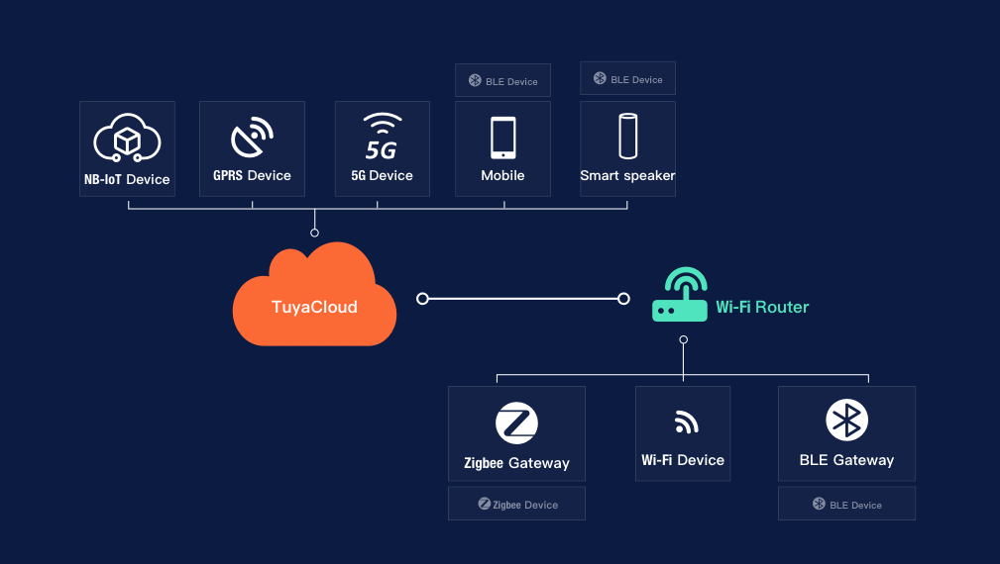

# TuyaDAEMON project


_**TuyaDAEMON's goal is to integrate the entire Tuya ecosystem into node-red, and not just to control some devices, creating a new level of abstraction that includes both Tuya-cloud and all possible custom extensions.**_

**Tuya ecosystem:**([_source Tuya_](https://developer.tuya.com/en/docs/iot/open-api/platform-overview/solution-overview))



**TuyaDAEMON** has a high-level interface: in reading, the data of all devices are available in an updated global RT object, with a _device:capability:value hierarchy_, with names chosen by the user.
Example:
````
              tuyastatus: object
                   humidifier: object
                       _connected: true
                       spray: "OFF"
                       output: "small"
````
In writing, the state change requests for all devices take the form of a node-red message:
````
              payload: object
                    device: "umidificatore"
                    property: "spray"
                    value: "ON"
````
All the details of the communication are resolved by **tuyaDAEMON**, using 3 bidirectional communication channels transparently to the user:

### LOW LEVEL MQTT (see tuya [DEAMON core](./tuyaDAEMON/README.md))

Using [node-red-contrib-tuya-smart-device](https://github.com/vinodsr/node-red-contrib-tuya-smart-device) you can exchange MQTT communications with many Tuya devices. You receive notifications of device status changes regardless of the cause: Tuya-cloud, smartlife app, voice control. And vice versa, the commands sent by **tuyaDAEMON** are executed by the devices and all the app interfaces are kept updated in real time. 

### HI LEVEL TRIGGER (see [tuyaTRIGGER](./tuyaTRIGGER/README.md))
The triggers do not connect to individual devices, but create a direct and bidirectional connection with Tuya-cloud events and 'automations', allowing complete control of both the smartlife logic and the devices not handled by LOW-LEVEL MQTT channel ('mirror' devices: see ['siren mirror'](./extra/siren%20mirror/README.md)).

  Example: _Using a “Smart Home Infrared Universal Remote Controller” device you have replicas of the various remote controls on your smartphone, even better than those I had developed in 2016 (see [remoteDB](https://github.com/msillano/remotesDB)). Very well: thanks to Tuya I can now control 2 televisions, a monitor, an air conditioner, a DVB tuner and a TV-top-box from my smartphone! There are some limitations: voice commands cannot be used, moreover, since the device does not use the MQTT protocol, it cannot be controlled at LOW LEVEL._
  _However, **Tuya-cloud** resources can be used to create a 'scene' with the sequence of commands needed to tune a TV channel, e.g. "Rai 3 HD", on the living room television. As  icon I will use the RAI3 logo, as name 'tune rai three'. Now I can use the voice command: "Hey Google, run tune Rai three"!_
  _A_ "mirror" device _standardizes this behavior in **tuyaDEAMON**, using TRIGGERS to execute commands. I can now create a node-red automation, which, if I am at home, automatically turns on the television and tunes in RAI 3 when my favorite TV serie is on the air!_
````  
          	   tuyastatus: object
                    living.tv: object
                         channel: "RAI3 HD"
                         comment: "available: 'RAI1 HD’,’RAI2 HD’,’RAI3 HD’..."
````
### CUSTOM CHANNEL (see 'fake' device)
Simple **node-red** flows constitute the interfaces to HD and SW resources, allowing to insert external resources, not tuya-compatible, into the system. A very useful two-tier model, consisting of a first level represented by tuyaDAEMON, which standardizes the various sources and devices, to provide all data and commands in a homogeneous way to the higher application level. Custom channels are implemented additively with specialized flows, one for each 'fake' device.

Example: _I also want to integrate some 24H weather forecasts with [weathermaps](https://openweathermap.org/) and local PM10 measurements (with ad hoc [HW, serial USB interface](https://www.banggood.com/search/pm2.5-pm10-detector-module-dust-sensor-2.8-inch-lcd.html)) into the system for better management of both the internal air conditioning and the outdoor terrace watering system. Two 'fake' devices can be defined:_ 
````
            tuyastatus: object
                  weather 24H: object
                        _id: "8fa7972******"
                        _appid: "b1b15e88fa79722541******"
                        tmin: "3.5"
                        tmax: "11.8"
                        rain: "5"
                  air quality: object
                        PM10: "3.5"
                        PM2.5: "11.8"
                        PM10 today: [3.6,3.6,3.7,4.1, 4.3, 3.9,3.5,0,0,0,0,0,0,0,0,0,0,0,0,0,0,0,0,0]
````

  _Two simple **node-red** flows update this data, say every hour._
  _**TuyaDEAMON** automatically logs each measurement on the DB, a useful option for analysis and statistics, while now we are able to manage, in a simple and homogeneous way, new conditions and automatisms that cannot be achieved using only **Tuya-cloud** resources._

_If you are interested in the reasons behind the tuyaDAEMON's project choices, you can read [why-tuyaDEAMON](why-tuyaDAEMON.pdf) - In italiano: [perché-tuyaDAEMON](perchè-tuyaDEAMON.pdf). note: To make links work, download the pdf file and use your viewer._

