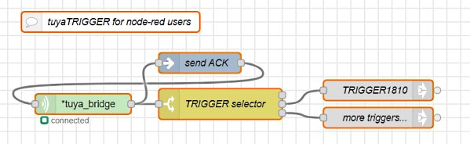

# tuyaTRIGGER for node-red users

_This flow enables node-red users to add remote control and voice control to their projects in a simple way._

It uses the `tuya cloud` and only `one switch` device: because _Smartlife_ app and the use of  _Tuya cloud_ are free, only you need to buy the device (USD 8-10), used as dual port register. Requires WiFi.

On your _smartlife_ app you can create up to 100 buttons to activate your TRIGGER (e.g. 1800, 1810... 1890), you can enable up to 20 other users and you get worldwide remote control over your node-red flows. Button names and icons are customizable.

If you want, Googlehome can also add _voice control_ to your TRIGGER.

This is a downsizing of [tuyaTRIGGER](https://github.com/msillano/tuyaDAEMON/tree/main/tuyaTRIGGER), created to _integrate node-red into the tuya ecosystem for home automation_. Watch it for more details on devices tested for this use.

- Install in node-red the node (I use 'manage pallette'): [node-red-contrib-tuya-smart-device](https://github.com/vinodsr/node-red-contrib-tuya-smart-device)
- To use this node, you need the 'id' and 'key' of your device: see [here](https://github.com/codetheweb/tuyapi/blob/master/docs/SETUP.md)
-_note: based on switch used, you may must change the 'data point' used by the counter: change it in nodes 'send ACK' and 'trigger selector'._
