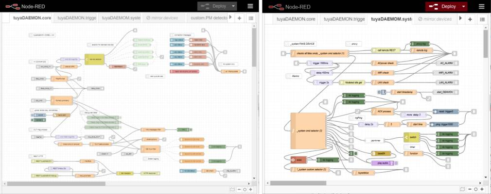
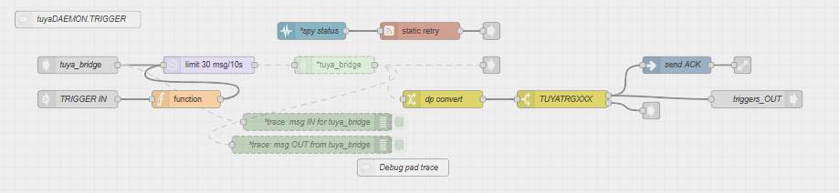

# TuyaDAEMON core

_TuyaDAEMON's goal is to integrate the entire Tuya ecosystem into node-red, and not just to control some devices, creating a new level of abstraction that includes both Tuya-cloud and all possible custom extensions._

TuyaDAEMON isolates your home automation **custom application** from all details of _tuya/node-red data and commands exchanges_:
- do not require user hacking in any Tuya or custom device.
- allows bidirectional exchanges to/from _any Tuya or custom device and Tuya-cloud_.
- decodes and transforms incominig data  to _standard units_.
- manages all codifications and checks before sending your _commands to devices_
- tuyaDAEMON is 'open' by design:
    - updates the `global.tuyastatus` structure (_device:property:value_) with all status messages from all controlled devices.
    - logs all commands and events in the mySQL` 'tuyathome:messages'` table
    - offerts complete MQTT and HTTP REST interfaces 
- uses _frendly names_ for all devices and properties, in any language

### IMPLEMENTATION

 To interact low-level with _Tuya devices_ I chose [`node-red-contrib-tuya-smart-device`](https://github.com/vinodsr/node-red-contrib-tuya-smart-device), which uses [tuyapi](https://github.com/codetheweb/tuyapi), the most interesting software on **tuya<=>node-red** integration that I have found.
 They do their job well, but there are some limitations:
 
  
  1) The capabilities of the Tuya communication are very variable for different devices: e.g. I have found very few devices that respond to `schema` request, and found cases where the data exchanges are not MQTT (e.g. infrared universal control).

  2) Some devices are unreachables: **TuyAPI** does not support some sensors due to the fact that they only connect to the network when their state changes. They are usually battery powered WiFi devices ([see note](https://github.com/codetheweb/tuyapi#-notes)).
 
 3) _Tuya devices_ can update  their own firmware version via **OTA**: for the user, this is an investment guarantee, but it can introduce problems when the software (`tuyapi` and `tuya-smart-device`) is not updated: some device messages can't be decoded (see [issue#17](https://github.com/vinodsr/node-red-contrib-tuya-smart-device/issues/27)).
 
 4) Tuyapi sometimes finds an error message from devices: `"json obj data unvalid"`: the source of this is not clear (see [issue#246](https://github.com/codetheweb/tuyapi/issues/246)), maybe a catch-all error message, but the best interpretation is "_the required operation is not available_".
 
 5) Each _Tuya device_ can only make a limited number of simultaneous MQTT connections. This number, which differs from device to device, can be low: in this case the device will close the tuyaDEAMON connection when one or more apps (smartLife, Tuya smart, google home ...) are active. Fortunately, I only found a few devices with very low potential connections. 

 _To manage such a rapidly changing environment, I choose to use a data structure in **tuyaDAEMON** to describe individual devices and single datapoint capabilities, so that all operations that are actually not managed or bogous can be intercepted and not sent to the device, giving stable and reliable operations with no surprises. And if the evolution of the SW offers us new features, it is easy to update the behavior of tuyaDAEMON._
 
 _To enable HI-LEVEL communications with Tuya-cloud you must use the [tuyaTRIGGER module](https://github.com/msillano/tuyaDAEMON/tree/main/tuyaTRIGGER) which uses an alternative communication mechanism with the devices._
_This allows [fast and reliable](https://github.com/msillano/tuyaDAEMON/wiki/tuyaTRIGGER-info) two-way communication of commands and events even with all devices not reachable via MQTT from the `tuyapi` library (WiFi sensors, IR controls, etc.)._
_**The use of tuyaDAEMON + tuyaTRIGGER guarantees the user that in any case all Tuya devices can be integrated.**_
  
### applications
_tuyaDEAMON is a powerful [event processor](https://github.com/msillano/tuyaDAEMON/wiki/tuyaDAEMON-as-event-processor) with a rich framework for IoT, offering to the power user many ways to implement their own projects:_

1. users can add new functionalities, i.e. new tasks, building more js SW only devices, to cover the sector of interest (see [_system](https://github.com/msillano/tuyaDAEMON/wiki/custom-device-_system))
2. users can add any not-Tuya hardware device, with a simple node-red interface flow (see [PM_detector](https://github.com/msillano/tuyaDAEMON/wiki/custom-device-'PM-detector':-case-study))
3. users can design and build new devices from existing ones, in OO style (see [OO devices](https://github.com/msillano/tuyaDAEMON/wiki/ver.-2.0--milestones#oo-devices) and [watering_sys](https://github.com/msillano/tuyaDAEMON/wiki/derived-device-'watering_sys':-case-study))
4. users can build inside tuyaDAEMON ['chains' (meta-programming)](https://github.com/msillano/tuyaDAEMON/wiki/tuyaDAEMON-as-event-processor#share-and-command-chains) using existing tasks to get the required event-driven behavior: test, delay, sequences, repetions and fork of tasks  are simple to implement (example: [system.beep_loop](https://github.com/msillano/tuyaDAEMON/wiki/tuyaDAEMON-as-event-processor#iteration)).
5. the entire tuyaDAEMON engine can be integrated into any larger user project using the favorite interface: node-red or MQTT or HTTP REST or database.
 
 _Any effort is made to make it modular, small, easy to modify, and [fully documented](https://github.com/msillano/tuyaDAEMON/wiki)._
 
 
 In **tuyaDAEMON**  since 2.0 we have 3 main modules plus some extras:
 

 
 - **tuyaDEAMON CORE:** the main flow, for low-level MQTT communication with many tuya `'real' devices`, and also with devices using a _gateway_ (`'virtual' devices`) e.g. Zigbee sensors.
 
 - [**tuyaTRIGGER module**](https://github.com/msillano/tuyaDAEMON/tree/main/tuyaTRIGGER) for Tuya-cloud comunications, adds extra capabilities:
   - The start of **tuya automations** from _node-red_.
   - The ability to fire **node-red flows** from _smartlife_, enabling _node-red remote_ and _vocal_ control.
   - The management RT of `'mirror' devices` for _all devices not caught at low-level by **tuyapi**_.
  
   
  - [**System module:**](https://github.com/msillano/tuyaDAEMON/wiki/custom-device-_system) In form of `'fake' device` **_system** offerts some useful properties: _Alarms_ in case of WiFi, Lan or AC power down, access to remote tuyaDEAMON servers, etc. See also the [reference documentation](https://github.com/msillano/tuyaDAEMON/blob/main/devices/_system/device__system.pdf).
 
  - **tuyaDEAMON MQTT:** a broker that offers acces to tuyaDAEMON via MQTT and allows the use of [simple UI](https://raw.githubusercontent.com/msillano/tuyaDAEMON/main/pics/ScreenShot_20210612210400.png).
  
  - **433 MHz gateway module:** a module to receive data from device using 433.92 MHz, 868 MHz, 315 MHz, 345 MHz and 915 MHz ISM bands. [Two devices](https://github.com/msillano/tuyaDAEMON/wiki/case-study:-433-MHz-weather-station) implemented: 'Weather station' and 'extra temperature' probes.

  - _Extra flow_: ["PM detector"](https://github.com/msillano/tuyaDAEMON/wiki/custom-device-'PM-detector':-case-study), a `'custom' device` study case, this device uses USB-serial to comminicate.
 
 - _Extra flow_: ["watering_sys"](https://github.com/msillano/tuyaDAEMON/wiki/custom-device-'watering_sys':-case-study), a `OO level 2 device` study case, a custom super-device build using 2 switch and 1 sensor. With an UI ad hoc.
 
 - _Extra subflow_: ["Ozone_PDMtimer"](https://github.com/msillano/tuyaDAEMON/wiki/custom-device--MQTT-'Ozone_PDMtimer'-case-study) example of MQTT devices integration, using a general purpose MQTT-tuya adapter node.
 
- _Extra flow_: "mirror devices" with some examples of triggers use.
 
- **tuiaDAEMON.toolkit** is an [external application](https://github.com/msillano/tuyaDAEMON/wiki/tuyaDAEMON-toolkit) in PHP that uses a MySQL database to store all information about the devices and creates some useful artifacts. Using this app, you can test the capabilities of any new device, sending commands (GET/SET/MULTIPLE/SCHEMA/REFRESH) to all DPs. A growing collection of [known devices](https://github.com/msillano/tuyaDAEMON/tree/main/devices) is ready, but it is easy to extend it to your new devices.

### configuration

In addition to usual configuration requirements for the `mySQL`, ´MQTT´ and your `tuya-smart-device` nodes:
     
1) Since 2.2.0, all configuration data are in a ´Global MODULE config´ node, with a friendly user interface (one in every module) to make simple the configuration task. Only some special node-red configuration nodes requires the user direct setup: mySQL, MQTT, tuya-smart-device (new devices).     
     
2)  _CORE_ includes [`global.alldevices`](https://github.com/msillano/tuyaDAEMON/wiki/tuyaDAEMOM-global.alldevices), a big JSON structure with all required information on `real/virtual/fake` devices, that control the _CORE_ behavior on a device/dps basis. Any [new device](https://github.com/msillano/tuyaDAEMON/wiki/Howto:-add-a-new-device-to-tuyaDAEMON) must be added to it. To update/modify/edit this structure:
    - you can edit it directly using the 'global CORE config' node.
    - you can export it to the file `alldevices.json` for backup or to edit it using external editors (e.g. _Notepad++_ and _'JSON Viewer'_ plugin) and back with copy-paste.
    - The application [tuyaDAEMON.toolkit](https://github.com/msillano/tuyaDAEMON/wiki/tuyaDAEMON-toolkit) can produce an `'alldevice'` scheletron starting from a _DB of tuya device definitions_.
      
2) To reduce the workload in the production environment:
      - `filters xxx` node reduce the info and the DB writing charge (you can also disable/delete the DB nodes if you don't need it). 
      - sice 2.2.0: added a general _filtering_ feature, on device/dp basis, user defined in _alldevices_ (see [alldevices wiki](https://github.com/msillano/tuyaDAEMON/wiki/tuyaDAEMOM-global.alldevices#output-control))
   
4) All nodes requiring or allowing some user update are named with an asterisk (e.g. '*device selector') and in the  'node description' you can found specific instructions.

 
 ### installation
 - Precondition: It is not required to have any Tuya device to install or test tuyaDAEMON, you can use it as framework for any IOT purpose. Since ver.2.2.0: you can test any module capabilities and the user can add later the devices. 
   
 - Precondition: clean node-red installed and working. 
      See also [multiple instances](https://github.com/msillano/tuyaDAEMON/wiki/ver.-2.0--milestones#multiple-instances-of-tuyadaemon-in-the-same-server) before install tuyaDEAMON.
  
 - Precondition: a _mySQL_ server is optional, but required for a serious use.
         - Create a DB 'tuyathome' (as start: user 'root' and no password)
         - Import the  `DB-core.2.2.0.sql.zip`  to create the required tables. 

1. Install in node-red the required nodes (I use 'manage pallette'): 
   
   
   
 - [node-red-contrib-tuya-smart-device](https://flows.nodered.org/node/node-red-contrib-tuya-smart-device)
 - [node-red-node-mysql](https://flows.nodered.org/node/node-red-node-mysql)
 - [node-red-contrib-config](https://flows.nodered.org/node/node-red-contrib-config)
 - [node-red-contrib-jsontimer](https://flows.nodered.org/node/node-red-contrib-jsontimer)
 - [node-red-contrib-looptimer-advanced](https://flows.nodered.org/node/node-red-contrib-looptimer-advanced)
 - [node-red-contrib-play-audio](https://flows.nodered.org/node/node-red-contrib-play-audio)
 - [node-red-contrib-timerswitch](https://flows.nodered.org/node/node-red-contrib-timerswitch)
 - [node-red-contrib-ui-led](https://flows.nodered.org/node/node-red-contrib-ui-led)
 - [node-red-dashboard](https://flows.nodered.org/node/node-red-dashboard)
 - [node-red-node-base64](https://flows.nodered.org/node/node-red-node-base64)
 - [node-red-node-serialport](https://flows.nodered.org/node/node-red-node-serialport)
 - [node-red-contrib-aedes](https://flows.nodered.org/node/node-red-contrib-aedes)
        
2. If you like, you can update the node-red-contrib-tuya-smart-device v. 4.1.1: see [issue#83](https://github.com/vinodsr/node-red-contrib-tuya-smart-device/issues/83).
3. Now you can import the [required tuyaDEAMON modules](https://github.com/msillano/tuyaDAEMON/blob/main/tuyaDEAMON.full.2.2.0.zip) (json file) in node-red. 
4. For any added module, read the flow description and see the documentation of the ´global MODULE config´ node: it contains all the updated configuration instructions. 
5. In each module, you will find some standalone tests (see also each test node documentation), to verify your installation: after you can delete them.

_For Android deployement see the [wiki](https://github.com/msillano/tuyaDAEMON/wiki/deployment:-android-server)_

-------------------
 ### Tuya devices capabilities, _as currently known_ ###
 
_Any tuya device, any DP can have its own behavior: tuya devices use a poll of [common HW, definitions](https://developer.tuya.com/en/docs/iot/terms?id=K914joq6tegj4) and code, but they are designed by different manufacturers, with objectives and exigences very different. (e.g.: some manufacturers try to promote their apps, reducing the performance of their products in the Tuya environment, etc...).
Usually it is very dangerous to do generalizations based on few cases._

**Device Capabilities:**

**response:**
All tuya devices react to external or internal commands by sending messages, which we find in output from the *tuya-smart-device* nodes. All responses have the same format: one or more pairs _(dp: value)_, regardless of whether they are caused by PUSH, REFRESH, GET, SET, SCHEMA, MULTIPLE commands (see CORE.logging node _Description_ for details).

**MULTIPLE:** implemented in a few devices, it acts like many SETs. It can return:

- all DPs in the command
- only the modified DPs
- a mixed strategy: if any DP changes, it returns only the modified DPs, otherwise all the DPs. (e.g. [power\_strip](https://github.com/msillano/tuyaDAEMON/blob/main/devices/power\_strip/device\_power\_strip.pdf)).
- deprecated in tuyaDAEMON because it requires encoded data values.

**SCHEMA:** implemented in few bigger devices, returns the values of all DPs (e.g. [ACmeter](https://github.com/msillano/tuyaDAEMON/blob/main/devices/ACmeter/device\_ACmeter.pdf)).

**REFRESH:** implemented in few devices, forces a new data sample or update. Returns only the PDs that have changed. 

- _smartLife app_ repeats REFRESH every 5s, when it is required by a responsive UI, but only when the UI is visible, to reduce the resources use.

**Data Point Capabilities:**

_The value of a DP is usually atomic (boolean, integer, string), for easy use in tuya-cloud automation. 
But some DPs can use structured values, e.g. in the case of configuration data, usually defined in a page of the UI, and not used in automation. Structured data is usually JSON, base64 encoded. In many cases the ´encode/decode´ functions (see <code>core.ENCODE/DECODE user library</code> node) are indispensable for obtaining human readable values._

Any DP as is own behavior:

- A DP can be proactively **PUSHED** by a device, especially to keep the UI up to date:
   - at regular intervals (for example, every hour, at XX:00:00 see [TRV_Thermostatic_Radiator_Valve](https://github.com/msillano/tuyaDAEMON/blob/main/devices/TRV_Thermostatic_Radiator_Valve/device_TRV_Thermostatic_Radiator.pdf).'Hist day target T').
   - at irregular intervals (unknown rule) (e.g. [Temperature_Humidity_Sensor](https://github.com/msillano/tuyaDAEMON/tree/main/devices/Temperature_Humidity_Sensor/device_Temperature_Humidity_Sensor.pdf).'temperature')
   - at a change in value (e.g. every 30s * k: [smart_breaker](https://github.com/msillano/tuyaDAEMON/blob/main/devices/smart_breaker/device_smart_breaker.pdf).'countdown ', e.g. at any variation: [device_switch-4CH](https://github.com/msillano/tuyaDAEMON/blob/main/devices/switch-4CH/device_switch-4CH.pdf).'countdown1')
   - to inform the user about the progress of a slow task  (e.g. [WiFi_IP_Camera](https://github.com/msillano/tuyaDAEMON/blob/main/devices/WiFi_IP_Camera/device_WiFi_IP_Camera.pdf ), after SET('start SD format', any))
   - for some DPs (e.g. sensors) PUSH may be the unique capability.(e.g. [Temperature_Humidity_Sensor](https://github.com/msillano/tuyaDAEMON/tree/main/devices/Temperature_Humidity_Sensor/device_Temperature_Humidity_Sensor.pdf)).

- **GET(DP)** is without side effects, it can be requested as many times as you want. GET returns:
    - the present **DP** value
    - the last **PUSHED** value (e.g. [switch-1CH](https://github.com/msillano/tuyaDAEMON/blob/main/devices/switch-1CH/device_switch-1CH.pdf).'countdown ')
    - all DPs (such as **SCHEMA**), ignoring the DP in the request (e.g. [power_strip](https://github.com/msillano/tuyaDAEMON/blob/main/devices/power_strip/device_power_strip.pdf)).
 
- **SET(DP, value)** If the value is not null, updates the DP value and returns the new value:
    - can be used as a **trigger**, i.e. with side effects, in this case the value may be useless and 'any' (e.g. [WiFi_IP_Camera](https://github.com/msillano/tuyaDAEMON/blob/main/devices/WiFi_IP_Camera/device_WiFi_IP_Camera.pdf ).'start SD format')

- **SET(DP, null)** returns the last DP value:
    - if it works, can be used instead of **GET(DP)**. It is useful when GET(DP) is not standard (e.g. [Power_strip](https://github.com/msillano/tuyaDAEMON/blob/main/devices/power_strip/device_power_strip.pdf)).
    - can be the only capability available: no other SETs, no GETs. (e.g. [device_WiFi_IP_Camera](https://github.com/msillano/tuyaDAEMON/blob/main/devices/WiFi_IP_Camera/device_WiFi_IP_Camera.pdf).'SD status')
    - can be not allowed: all SET(dp, value) are ok, but not SET(DP, null).

IMPORTANT: Sending commands that are not implemented or not allowed or sending wrong data type or wrong value to a DP can have many bad effects:

- Nothing, silent ignore
- SET/GET of unespected values
- the message _"json obj data unvalid"_
- waiting for some time, then device disconnection.
- gateway disconnection.
- the device "reboot themself".
- the device hangup, you must restart.
- the gateway hangup.

To have a flexible but robust framework it is always necessary:
1. study each new device in detail ([tuyDAEMONtoolkit](https://github.com/msillano/tuyaDAEMON/wiki/tuyaDAEMON-toolkit) can helps you in this task).
2. use a data structure that verifies the commands sent to each device (like [global.alldevices](https://github.com/msillano/tuyaDAEMON/wiki/tuyaDAEMOM-global.alldevices) object in tyuaDAEMON CORE).
 
--------------------

**versions**
_tuyaDAEMON version 2.2.0_ 
  - Maintenance release: better user experience, installation, customization.
  - standardization of startup and options in 'Global MODULE config' nodes.
  - Refactoring 'json_library', now implemented as a global singleton.
  - separate node for encoding/decoding functions library.
  - added "hide" field to global.alldevices for user visibility control.
  - bug fixes and minor code updates
  - added properties to 'core' and 'trigger' (new 'fake' devices).
  - added tests to any module
  - node-red-contrib-tuya-smart-device 4.1.1, modified as in [ISSUE#83](https://github.com/vinodsr/node-red-contrib-tuya-smart-device/issues/83).
  - tuyapi ver. 7.2.0
    
_tuyaDAEMON version 2.1_ (13/06/2021)
- node-red-contrib-tuya-smart-device 4.1.1
- tuyapi ver. 7.2.0

   Added tuyaDAEMON MQTT interface
   minor bug corrections

_tuyaDAEMON version 2.0_ (13/05/2021)
- node-red-contrib-tuya-smart-device 4.0.2, modified as in [ISSUE#57](https://github.com/vinodsr/node-red-contrib-tuya-smart-device/issues/57#issue-863780858).
- tuyapi ver. 7.1.0

   General revision: core added OO and remote extensions,  added 'share'.
  Refactoring '_system'.,  Updated wiki
  - more custom devices (water_sys, PM_detector)

   note: Don't use the **node-red-contrib-tuya-smart-device 4.0.1** because it presents [some problems](https://github.com/vinodsr/node-red-contrib-tuya-smart-device/issues/54).

_tuyaDAEMON version 1.3_ (01/03/2021)
- node-red-contrib-tuya-smart-device 3.0.2
- tuyapi ver. 3.1.1
- 
  Tuya_bridge uses the TYWR 7-32 relay. Trigger flows refactoring to separe custom flows.
  
_tuyaDAEMON version 1.2_ (12/02/2021)
- node-red-contrib-tuya-smart-device 2.0.0
- tuyapi ver. 6.1.1

  Added REST interface.
  new tuyaDAEMON.toolkit 1.0.
  Updated wiki documentation, added known devices.

_tuyaDAEMON version 1.1_ (19/01/2021)
- node-red-contrib-tuya-smart-device 2.0.0
- tuyapi ver. 6.1.1

  Code refactoring: added getter methods JSON library.
  Added DB ALARM, START ALARM.

_tuyaDAEMON version 1.0_ (15/01/2021)
- node-red-contrib-tuya-smart-device 2.0.0
- tuyapi ver. 6.1.1

  Initial version     
