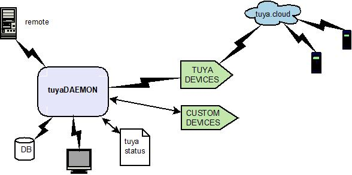

# TuyaDAEMON core

_TuyaDAEMON's goal is to integrate the entire Tuya ecosystem into node-red, and not just to control some devices, creating a new level of abstraction that includes both Tuya-cloud and all possible custom extensions._

TuyaDAEMON isolates your home automation **custom node-red flows** from all details of _tuya/node-red data and commands exchanges_:
- allows bidirectional exchanges to/from _all tuya devices and Tuya automations_.
- decodes and transforms incominig Tuya data  to _standard units_.
- manages all codifications and checks before sending your _commands to devices_
- updates the `global.tuyastatus` structure (_device:property:value_) with all status messages from Tuya devices.
- logs all events in the mySQL` 'tuyathome:messages'` table 
- uses _frendly names_ for all devices and properties, in any language

### IMPLEMENTATION

 To interact low-level with _Tuya devices_ I chose [`node-red-contrib-tuya-smart-device`](https://github.com/vinodsr/node-red-contrib-tuya-smart-device), which uses [tuyapi](https://github.com/codetheweb/tuyapi), the most interesting software on **tuya<=>node-red** integration that I have found.
 They do their job well, but there are some limitations:
 
  
  1) The capabilities of the Tuya communication are very variable for different devices: e.g. I have found very few devices that respond to `schema` request, and found cases where the data exchanges are not MQTT (e.g. infrared universal control).

  2) Some devices are unreachables: **TuyAPI** does not support some sensors due to the fact that they only connect to the network when their state changes. Usually are WiFi devices battery-powered ([see note](https://github.com/codetheweb/tuyapi#-notes)).
 
 3) _Tuya devices_ can update  their own firmware version via **OTA**: for the user, this is an investment guarantee, but it can introduce problems when the software (`tuyapi` and `tuya-smart-device`) is not updated: some device messages can't be decoded (see [issue#17](https://github.com/vinodsr/node-red-contrib-tuya-smart-device/issues/27)).
 
 4) Tuyapi sometimes finds an error message from devices: `"json obj data unvalid"`: the source of this is not clear (see [issue#246](https://github.com/codetheweb/tuyapi/issues/246)), but the best interpretation is "_the required operation is not available_".
 
 5) **Tuyapi** throws some errors at the moment not caught by **tuya-smart-device**: `"Error: Error from socket"` and `"find () timeout. Is the device turned on and the correct ID or IP?"`  (see [issue#35](https://github.com/vinodsr/node-red-contrib-tuya-smart-device/issues/35)).
 Because now a **tuya-smart-device** can't be disabled, these useless messages can be very frequent. In normal use, some devices can stay disconnected long time, such as power sockets or power strips used only on request.
 
 6) Each _Tuya device_ can only make a limited number of simultaneous MQTT connections. This number, which differs from device to device, can be low: in this case the device will close the tuyaDEAMON connection when one or more apps (smartLife, Tuya smart, google home ...) are active. Fortunately, I only found a few devices with very low potential connections. 

 _To manage such a rapidly changing environment, I choose to use a data structure in **tuyaDAEMON** to describe individual devices and single datapoint capabilities, so that all operations that are actually not managed or bogous can be intercepted and not sent to the device, giving stable and reliable operations with no surprises. And if the evolution of the SW offers us new features, it is easy to update the behavior of tuyaDAEMON._
 
  _To enable HI-LEVEL two ways communicatrions with tuya-cloud the [**tuyaTRIGGER**](https://github.com/msillano/tuyaDAEMON/tree/main/tuyaTRIGGER) module uses [TRIGGER](https://github.com/msillano/tuyaDAEMON/wiki/tuyaTRIGGER-info), and that allows the bidirectional event communication also with all devices unreachables by `tuyapi` (WiFi sensors, IR controls etc.)._ _**TuyaDAEMON + tuyaTRIGGER user is guaranteed that in any case all tuya devices will be integrated.**_
  
### customization
**TuyaDAEMON** is very exsperimental, the CORE module MUST be modified by the user for every new device. 
 
 _Any effort is made to make it modular, small, easy to modify, and [fully documented](https://github.com/msillano/tuyaDAEMON/wiki)._
 
 
 In **tuyaDAEMON** we have now four modules and a toolkit:
 
 
 
 
 - **tuyaDEAMON CORE:** the main flow, for low-level communication with many tuya `'real' devices`, and also with devices using a _gateway_ (`'virtual' devices`) e.g. Zigbee sensors.
 - [**tuyaTRIGGER module**](https://github.com/msillano/tuyaDAEMON/tree/main/tuyaTRIGGER) for Tuya-cloud comunications, adds extra capabilities:
   - The start of **tuya automations** from _node-red_.
   - The ability to fire **node-red flows** from _smartlife_, enabling _node-red remote_ and _vocal_ control.
   - The management RT of `'mirror' devices` for _all devices not caught at low-level by **tuyapi**_.
   
 - **Connection module:** add to all _real device_ the new property '_connected' to report RT the device status. Optional.
 - **System module:** Offerts a `'fake' device` (_system) with some useful RT properties: _Alarms_ in case of WiFi, Lan or AC power down, _list of unconned devices_ etc. 
   Optional, requires the  _'Connection module'_.
 - _Extra flow_: ["Smoke_Detector"](https://github.com/msillano/tuyaDAEMON/wiki/mirror-device-'Smoke_Detector':-case-study), a `'mirror' device` study case, uses TRIGGER to comunicate to real device.
 - _Extra flow_: ["PM detector"](https://github.com/msillano/tuyaDAEMON/wiki/custom-device-'PM-detector':-case-study), a `'custom' device` study case, the device uses USB-serial to comminicate.
 - _Extra flow_: ["watering_sys"](https://github.com/msillano/tuyaDAEMON/wiki/custom-device-'watering_sys':-case-study), a `OO level 2 device` study case, a custom super-devices build using 2 switch and 1 sensor.
 - _Extra flow_: ["test devices"](extra/test%20devices) with some examples of device tests
 - _Extra flow_: ["tuyaTRIGGER-minimal"](extra/tuyaTRIGGER%20for%20node-red%20users),  downsizing of TuyaTIGGER, adds one-way remote and voice control to node-red. Use it alone, not for home automation.

- **tuiaDAEMON.toolkit** is an [external application](https://github.com/msillano/tuyaDAEMON/wiki/tuyaDAEMON-toolkit) in PHP that uses a MySQL database to store all information about the devices and creates some useful artifacts.

### configuration

In addition to usual configuration requirements for the `mySQL` and your `tuya-smart-device` nodes:
     
1)  _CORE_ includes [`global.alldevices`](https://github.com/msillano/tuyaDAEMON/wiki/tuyaDAEMOM-global.alldevices), a big JSON structure with all required information on `real/virtual/fake` devices, that control the _CORE_ behavior on a device/dps basis. Any [new device](https://github.com/msillano/tuyaDAEMON/wiki/Howto:-add-a-new-device-to-tuyaDAEMON) must be added to it. To update/modify/edit this structure:
    - you can edit it directly using the _'alldevices'_ config node.
    - you can export it to the file `alldevices.json` for backup or to edit it using external editors (e.g. _Notepad++_ and _'JSON Viewer'_ plugin) and back with copy-paste.
    - The application [tuyaDAEMON.toolkit](https://github.com/msillano/tuyaDAEMON/wiki/tuyaDAEMON-toolkit) can produce an `'alldevice'` scheletron starting from a _DB of tuya device definitions_.
      
2) To reduce the workload in the production environment:
     - `debug` nodes can control the _debug pad_ content: enabling/disabling them the user can modulate the visible information.
     - `filters` can reduce the info and the DB writing charge (you can also disable/delete the DB node). 
     - see _'Debug pad options'_ comment node.
   
3)  _node 'tuyaDEAMON.CORE.save path': defines where to save the 'alldevices.json' file._

4) All nodes requiring or allowing some user update are named with an asterisk (e.g. '*device selector') and in the  'node description' you can found specific instructions.

 
 ### installation
   0. Precondition: _mySQL_ server running: import the  `tuyamessages.sql`  to create the required table. 
   0. Precondition: at least a _Tuya device_ installed and working with _smartlife_ app. You MUST know the `ID` and `Key` for your Tuya device(s): see [here](https://github.com/codetheweb/tuyapi/blob/master/docs/SETUP.md) for detailed instructions.
   0. Precondition: node-red installed and working.

   1. Install in node-red the nodes (I use 'manage pallette'): 
        - [node-red-contrib-tuya-smart-device](https://flows.nodered.org/node/node-red-contrib-tuya-smart-device)
        - [node-red-node-mysql](https://flows.nodered.org/node/node-red-node-mysql)
        - [node-red-contrib-config](https://flows.nodered.org/node/node-red-contrib-config)
   2. Import `tuyaDAEMON.json` and all required xxxx.json file in node-red.
   3. Configure in tuyaDAEMON the DB node `append to DB` (optional: you can disable/delete the DB node).
   4. Add to tuyaDAEMON your device(s). See [step-by-step instructions](https://github.com/msillano/tuyaDAEMON/wiki/Howto:-add-a-new-device-to-tuyaDAEMON).
   5. You can delete the unused modules and `example` nodes.

_For Android deployement see [wiki](https://github.com/msillano/tuyaDAEMON/wiki/deployment:-android-server)_

-------------------
 ### Tuya's capabilities, _as currently known_ ###
 
_Any tuya device can have its own behavior: tuya devices use a poll of common code, but they are designed by different manufacturers, with objectives and exigences very different. (e.g.: some manufacturers try to promote their apps, reducing the performance of their products in Tuya environment).
Usually is very dangerous to do generalizations based on few cases._

**Device Capabilities:**

**response**
The return messages, in output from tuya-smart-device nodes, have all the same format, one o more couples (dp: value) regardless of whether they are caused by PUSH, REFRESH, GET, SET or SCHEMA, MULTIPLE.

**MULTIPLE:** implemented in a few devices, it acts like many SETs. It can return:

- all DPs in the command
- only modified DPs
- a mixed strategy: if any DP changes, it returns only the modified DPs, otherwise all the DPs. (e.g. [power\_strip](https://github.com/msillano/tuyaDAEMON/blob/main/devices/power\_strip/device\_power\_strip.pdf)).

**SCHEMA:** implemented in few bigger devices, returns the values of all DPs (e.g. [ACmeter](https://github.com/msillano/tuyaDAEMON/blob/main/devices/ACmeter/device\_ACmeter.pdf)).

**REFRESH:** implemented in few devices, forces a new data sample or update. Returns only the PDs that have changed. 

- By repeating the REFRESH you can get any required data rate, for example to have a responsive UI. For linited time, to reduce resources use.

**Data Point Capabilities:**

_DPs are usually atomic, for easy use in automation. 
But DPs can be structured (even complex) e.g. in the case of configuration data, usually defined in a page of the UI, and not used for tests._
_Usually the UI is passive, i.e. shows the received values as response of user events. But it can use the REFRESH for a faster update._ 

Any DP as is own behavior:

- A DP can be **PUSHED** proctively by a device, especially to keep the UI updated:
   - at regular intervals (for example, every hour, at XX:00:00 see [TRV_Thermostatic_Radiator_Valve](https://github.com/msillano/tuyaDAEMON/blob/main/devices/TRV_Thermostatic_Radiator_Valve/device_TRV_Thermostatic_Radiator.pdf).'Hist day target T').
   - at irregular intervals (unknown rule) (e.g. [Temperature_Humidity_Sensor](https://github.com/msillano/tuyaDAEMON/tree/main/devices/Temperature_Humidity_Sensor/device_Temperature_Humidity_Sensor.pdf).'temperature')
   - at a change in value (e.g. every 30s * k: [smart_breaker](https://github.com/msillano/tuyaDAEMON/blob/main/devices/smart_breaker/device_smart_breaker.pdf).'countdown ', e.g. at any variation: [device_switch-4CH](https://github.com/msillano/tuyaDAEMON/blob/main/devices/switch-4CH/device_switch-4CH.pdf).'countdown1')
   - for some DPs (e.g. sensors) PUSH may be the unique capability.(e.g. [Temperature_Humidity_Sensor](https://github.com/msillano/tuyaDAEMON/tree/main/devices/Temperature_Humidity_Sensor/device_Temperature_Humidity_Sensor.pdf)).

- **GET(dp)** is without side effects, it can be requested as many times as you want. GET returns:
    - the present value
    - the last PUSHED value (e.g. [switch-1CH](https://github.com/msillano/tuyaDAEMON/blob/main/devices/switch-1CH/device_switch-1CH.pdf).'countdown ')
    - all DPs (such as SCHEMA) (e.g. [power_strip](https://github.com/msillano/tuyaDAEMON/blob/main/devices/power_strip/device_power_strip.pdf)).
 
- **SET(dp, value)** If the value is not null, updates the DP value and returns the new value:
    - can be used as a trigger, i.e. with side effects, in this case the value may be useless (e.g. [WiFi_IP_Camera](https://github.com/msillano/tuyaDAEMON/blob/main/devices/WiFi_IP_Camera/device_WiFi_IP_Camera.pdf ).'start SD format')

- **SET(DP, null)** returns the last DP value:
    - if it works, can be used instead of GET(DP). In some cases it is mandatory (e.g. [Power_strip](https://github.com/msillano/tuyaDAEMON/blob/main/devices/power_strip/device_power_strip.pdf))
    - can be the only property available: no other SETs, no GETs. (e.g. [device_WiFi_IP_Camera](https://github.com/msillano/tuyaDAEMON/blob/main/devices/WiFi_IP_Camera/device_WiFi_IP_Camera.pdf) .'SD status')
    - can be not allowed: all SET(dp, value) are ok, but not SET(DP, null).

note: commands that are not implemented or not allowed by a device or DP can have many effects:

- Nothing, silent ignore
- the message _"json obj data unvalid"_
- waiting for some time, then disconnection.
- device hangup.

--------------------

**versions**

note: Don't use the **node-red-contrib-tuya-smart-device 4.0.1** because it presents [some problems](https://github.com/vinodsr/node-red-contrib-tuya-smart-device/issues/54).

_tuyaDAEMON version 1.3_ (01/03/2021)
- node-red-contrib-tuya-smart-device 3.0.2
- tuyapi ver. 6.1.1

  Tuya_bridge uses the TYWR 7-32 relay. Trigger flows refactoring to separe custom flows.
  
_tuyaDAEMON version 1.2_ (12/02/2021)
- node-red-contrib-tuya-smart-device 2.0.0
- tuyapi ver. 6.1.1

  Added REST interface.
  new tuyaDAEMON.toolkit 1.0.
  Updated wiki documentation, added known devices.

_tuyaDAEMON version 1.1_ (19/01/2021)
- node-red-contrib-tuya-smart-device 2.0.0
- tuyapi ver. 6.1.1

  Code refactoring: added getter methods JSON library.
  Added DB ALARM, START ALARM.

_tuyaDAEMON version 1.0_ (15/01/2021)
- node-red-contrib-tuya-smart-device 2.0.0
- tuyapi ver. 6.1.1

  Initial version     
