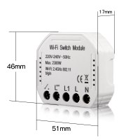
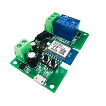

# tuyaTRIGGER 

_A real device WiFI, having  a big unused numerical parameter, say a 'counter', accessible via MQTT by both **Tuya** and **node-red**, is all the required hardware to implement a robust bilateral event communication (**TRIGGER**)._

The 'counter' is used as a dual port register: a sender (_tuya-cloud/node-red_) set the counter to some XX value, the receiver gets the XX value, acts accordingly, and resets the counter to 0 (ACK action): the _node-red_ read/write actions are performed by **tuyaTRIGGER** flow, the _Tuya-cloud_ actions are performed by ad hoc automations, one for TRIGGER.

 - _node-red => tuya_: **node-red** write a predefined value in the 'counter' and that fires a specific **Tuya** automation: first the automation must reset the 'counter' to 0, then it can do anything.
 Tuya automation, say `trigger1010`:   _If "counter:1010" do "counter:0" and "any-action..."_ 

 - _tuya => node-red_: A tuya **scene** (user action) or **automation** (event) sets  a predefined value on the 'counter' (e.g. 2030), and when node-red knows that, it must first reset  the "counter' to 0, then it can do anything.
 Tuya automation,  say `trigger2030`: _If "any-event" do "counter:2030"_ 

This [**TRIGGER** mechanism](https://github.com/msillano/tuyaDAEMON/wiki/tuyaTRIGGER-info), implemented in **tuyaTRIGGER**, allow a better _tuya <=> node-red_ integration in **tuyaDAEMON**:
 - _node-red_ can set/get status for _all devices and data point_ not found by `node-red-contrib-tuya-smart-device`.
 - _node-red_ can fire automation on _tuya-cloud_ 
 - _tuya scene_ can control _node-red flows_, so a node-red user can employ _smartlife_ as remote control (from anywhere).
 - _tuya automations_ can fire flows in _node-red_, implementing this way any control strategy not allowed by Tuya.
 - user can fire _node-red flows_ with vocal control (`Googlehome`)

### implementation

_This technique can be used with any device, named in the flow and in `alldevices` "tuya_bridge"._

  

1) _I choose first the Tuya_ [Switch MS-104](https://github.com/msillano/tuyaDAEMON/blob/main/devices/Smart_switch01/device_Smart_Switch01.pdf) (USD 8) _because its countdown (`dp` = 102) is with a large range [0-86400s, i.e. 24H] and still the device can be used as a WiFi switch, because only the countdown is used by tuyaTRIGGER, plus it is small and cheap._ 

   The unique problem with this switch is the lack of a battery backup.

2) _I also tested another device, a Tuya wifi switch_ [TYWR 7-32](https://github.com/msillano/tuyaDAEMON/blob/main/devices/switch-1CH/device_switch-1CH.pdf) (USD 10) _with a micro USB input, so it can be used with a power bank to get a UPS power supply._
It has all required features:  countdown (`dp` = 7) with a large range [0-86400s, i.e. 24H], independence (setting the countdown to 0 does not toggle the relay), so it is better than Switch MS-104.

   As against it is bigger and without case, and needs an external UPS power supply.
   
   I changed `tuya_bridge` to TYWR 7-32 at ver. 2.0: I put it in a box and connected it to the Android server USB, because this server is with a UPS power supply.

4)  'TuyaTrigger' value is placed in ad-hoc `msg.payload.tuyatrigger`.  

5)  COSTOMIZATION: you can use other devices to implement 'tuya-bridge. Updated information on 'Global TRIGGER config' node (since 2.2.0).

**note**
 
 - analog values can't be sent from tuya this way, because tuya does not allow the use of calculated values. But comparations are allowed: e.g. send trigger if `'temperature < 16'`. (Available: `<`; `=`; `>`). We can 'mirror' `BOOLEAN` dp (2 automations) `ENUM` dp: [0|1|2]  (3 automations) or also `INT`, but converted to ENUM when required: `{<15|16-20|21-25|26-30|31-35|36-40|>40}` but many automations are required (12 for this example).

 - using a countdown as a trigger, as _all switches_ does, requires REDTRG with numbers greater (e.g. 5000+) than TUYATRG (e.g. 1010..4999]): so, if _node-red_ is down, a Tuya TRIGGER not caught can't trigger a fake REDTRG.
 
 - If the used counter is a time counter (countdown in case of this switches) you must choose trigger values at least separated enough space, to allow the ACK action. 
  
 - for fallback, MUST exist a Tuya Automation fired when the countdown is less than any trigger value (e.g. 1050), to reset the countdown to 0 without ACK: so the countdown never interferes with the logic of the switch (this automation is also deployed by `_trgPing` implementation). Required automation:  `if "tuya_bridge"countdown = 1050, then "tuya_bridge"countdown:0` 
 
- Actual implementation does not verify the ACKs presence and timing, and not uses any handshake strategy, so it is theoretically possible to have some interferences.
--------------------
### MQTT tuya_bridge tests

Some fast tests to do in **MQTT explorer** (copy/paste, maybe edit value), see also [switch-1CH](https://github.com/msillano/tuyaDAEMON/blob/main/devices/switch-1CH/device_switch-1CH.pdf):

 | property  | op. |    MQTT topic               | value |                         notes|
| :------:  |:---------:|----------------------------|-----------|---|
|SCHEMA | GET| tuyaDAEMON/DEVPC/tuya_bridge/command  | &lt;empty> ||
| SCHEMA (device) | GET |tuyaDAEMON/DEVPC/HAL@home/command/\_doSCHEMA| "tuya_bridge" | 5 |
| SCHEMA (tuyastatus) | GET |tuyaDAEMON/DEVPC/HAL@home/command/\_tuyastatus | {"device":"tuya_bridge"} | 6 |
|relay | SET | tuyaDAEMON/DEVPC/tuya_bridge/command/relay | ON/OFF | |
|restart status | SET |  tuyaDAEMON/DEVPC/tuya_bridge/command/restart status | off/on/menory | |
|backlight | SET | tuyaDAEMON/DEVPC/tuya_bridge/command/backlight | true/false | |
|circulate | SET |  tuyaDAEMON/DEVPC/tuya_bridge/command/circulate | [{"active": "true"/"false", "day":"SMTWTF-", "start": "HH:MM", "end": "HH:MM", "on": "HH:MM", "off": "HH:MM"},..]/[] | 1 |
|random  | SET | tuyaDAEMON/DEVPC/tuya_bridge/command/inching  |[{"active": "true"/"false", "day":"DLMMGVS", "start": "HH:MM", "end": "HH:MM"},..]/[]|1  |
|inching | SET | tuyaDAEMON/DEVPC/tuya_bridge/command/inching  | 	{ "inching": "true"/"false" "delay": 0..3660}| |
|light mode | SET |  tuyaDAEMON/DEVPC/tuya_bridge/command/light mode | 	pos/none/relay| |
|tigger (reserved)| | _not accassible directly_ | 0..86500 | 2|
|TRIGGER | SET |   tuyaDAEMON/DEVPC/HAL@home/command/\_doTrigger    |5000| 3|
|TRIGGER | SET |   tuyaDAEMON/DEVPC/HAL@home/command/\_doTrigger     |5020|3|
|TRIGGER | SET |   tuyaDAEMON/DEVPC/HAL@home/command/\_toFastIN   |{"device":"tuya_bridge", "property":"trigger (reserved)", "value" : 5000} | 4|
|TRIGGER | SET |   tuyaDAEMON/DEVPC/HAL@home/command/\_toFastIN   |{"device":"tuya_bridge", "property":"trigger (reserved)", "value" : 5020} |4|

_notes_
1) The "day" is a string of 7 chars (a week), starting from 'Sunday': '-' minds 'skip', any char minds 'run'
2) Reseved to TRIGGERs, not accessible via GET/SET (see `global.alldevices` definition).
3) TRIGGER SET using `'system'.\_doTrigger`: the TRIGGER is sent to _tuya-cloud_, where it fires an existing  automation 'If "tuya_bridge"Countdown 1 : equals 5000 (or 5020)...'
4) TRIGGER SET using `'system'.\_toFastIN` (no checks): the TRIGGER is sent to _tuya-cloud_, where it fires an existing automation 'If "tuya_bridge"Countdown 1 : equals 5000 (or 5020)...'
5) The standard _SCHEMA_ is usable only on devices that implement it. the syste.doSCHEMA (device)_ uses the result of GETs from all readable dps of the device, so it is always usable.
6) The _SCHEMA (tuyastatus)_ reads data from `global.tuyastatus`, so get also PUSH only dps, or pseudoDP (like '_connected') and can be used with any device.
--------------------
**Versions**

_tuyaTRIGGER version 2.0_ (13/05/2021)
  - included in tuyaDAEMON ver 2.0 (tuyaDAEMOM-full.2.0.json)
  
_tuyaTRIGGER version 1.1_ (19/01/2021)
  - tuyaDAEMON ver 1.1
  
_tuyaTRIGGER version 1.0_ (15/01/2021)
  - tuyaDAEMON ver 1.0

Initial version     
